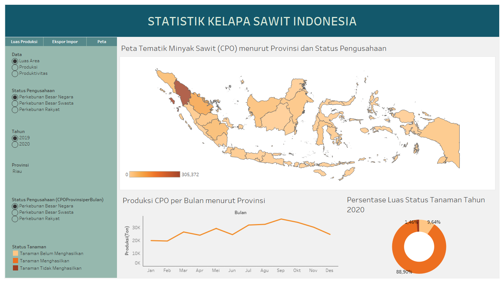

<!-- ABOUT THE PROJECT -->
# Dashboard Interaktif untuk Visualisasi Data Kelapa Sawit Indonesia

Harga minyak sawit tengah mengalami lonjakan yang luar biasa dibeberapa tahun terakhir. Lonjakan ini menyebabkan kekacauan di berbagai sektor terutama sektor perdagangan. Produk minyak sawit berupa minyak goreng di Indonesia saat ini sedang mengalami kelangkaan. Sedangkan banyak usaha mikro kecil dan menengah (UMKM) yang menggunakan minyak goreng sebagai bahan utama dalam usahanya. Hal ini tentu membuat para pengusaha UMKM kewalahan karena untuk mendapatkan minyak goreng harus membayar cukup mahal. Hal ini menimbulkan banyak pertanyaan seperti sebenarnya bagaimana produksi minyak sawit di Indonesia selama beberapa tahun terakhir. Sebagian masyarakat mungkin akan bingung jika diberikan data minyak sawit karena jumlahnya yang sangat banyak. Oleh karena itu, diperlukan sebuah dashboard visualisasi data tentang kelapa sawit Indonesia untuk meringkas data yang jumlahnya sangat banyak. Dashboard ini tidak hanya menampilkan produksi minyak sawit, namun juga luas areal perkebunan sawit, ekspor dan impor, serta bagaimana perkembangannya dari tahun ke tahun. Didalam dashboard ini juga disajikan peta tematik untuk mempermudah melihat provinsi-provinsi sesuai dengan luas dan produksi minyak sawitnya.

(<a href="#top">back to top</a>)

## Persiapan Data
Untuk membuat sebuah visualisasi langkah pertama yang dilakukan adalah menyiapkan data. Software Tableau memiliki format data tersendiri agar dapat diolah. Sedangkan data yang dijadikan referensi masih belum memiliki format yang sesuai untuk dilakukan visualisasi di Tableau. Oleh karena itu perlu dilakukan penyesuaian data agar data dapat terbaca ke dalam Tableau. Berikut ini adalah data yang sudah disesuaikan.

Project data : 
<a href="https://docs.google.com/spreadsheets/d/1CKjDNqLGJytkXf0AaexFTEnckpWFJRX2/edit?usp=sharing&ouid=102079076834698723784&rtpof=true&sd=true">Data Kelapa Sawit</a>

Setelah itu data tersebut dapat diimport ke aplikasi Tableau. Langkah selanjutnya adalah menghubungkan tabel-tabel yang ada. Hal ini dilakukan agar fitur-fitur interaktif dapat dijalankan. Misalnya tabel 'Luas dan Produksi' dan 'Luas dan Produksi CPO' dihubungkan dengan status pengusahaan. Berikut ini adalah gambar hubungan antar tabel dalam dashboard ini.

(<a href="#top">back to top</a>)

## Pembuatan Visualisasi
Dashboard visualisasi ini memiliki tiga halaman atau menu yaitu halaman Luas dan Produksi, halaman Ekspor dan Impor, dan halaman Peta Tematik.

### 1. Halaman Luas dan Produksi
Halaman ini menampilkan 4 visualisasi yang berkaitan dengan luas dan produksi kelapa sawit berupa visualisasi line chart dan stacked bar chart (horizontal). Line chart digunakan untuk menvisualisasikan data deret waktu. Sedangkan bar chart (horizontal) digunakan untuk memvisualisasikan persentase data.

* Line chart Luas Areal Kelapa Sawit 2000-2020

* Line chart Produksi Kelapa Sawit 2000-2020

* Stacked Bar chart Persentase Luas Areal Kelapa Sawit menurut Status Pengusahaan

* Stacked Bar chart Persentase Produksi Kelapa Sawit menurut Status Pengusahaan

### 2. Halaman Ekspor dan Impor
Dalam halaman ini menampilkan 4 visualisasi yang berkaitan dengan ekspor dan impor berupa visualisasi line chart dan bar chart. Line chart digunakan untu memvisualisasikan data deret waktu, sedangkan bar chart untuk membandingkan suatu data.

* Line chart Ekspor 2000-2020

* Line chart Impor 2000-2020

* Bar chart Benua Tujuan Ekspor

* Bar chart Benua Asal Impor

### 3. Halaman Peta Tematik
Halaman ini menampilkan 3 visualisasi yang berkaitan dengan produksi CPO per provinsi. Visualisasi yang digunakan adalah peta, line chart, dan donat chart. Peta digunakan untuk memvisualisasikan data luas, produksi, dan produktivitas CPO di tiap provinsi. Line chart digunakan untuk memvisualisasikan data produksi CPO perbulan. Sedangkan donat chart digunakan untuk melihat persentase status tanaman tiap provinsi.

* Peta Tematik Minyak Sawit (CPO) menurut Provinsi dan Status Pengusahaan

* Line chart Produksi CPO per Bulan menurut provinsi

* Donat chart Persentase Luas Status Tanaman Tahun 2020

(<a href="#top">back to top</a>)

## Penambahan Fitur Interaktif
Fitur interaktif yang digunakan dalam dahsboard visualisasi ini adalah dengan memanfaat filter. Dengan menggunakan filter maka satu atau lebih visualisasi akan berubah sesuai filter. Hal ini akan mempermudah pembaca jika mereka ingin fokus terhadap salah satu kategori.

(<a href="#top">back to top</a>)

## Pembuatan Dashboard
Dashboard visualisasi kelapa sawit ini dapat menampilkan 3 halaman dalam 1 windows. Cara kerjanya yaitu dengan menambahkan menu navigasi untuk berpindah-pindah halaman. Sehingga dalam satu dashboard terdiri dari banyak visualisasi namun tidak sesak karena dibagi-bagi kedalam 3 halaman berbeda. Hal ini dimaksudkan agar dahsboard dapat memuat banyak informasi namun dengan tampilan yang sederhana dan efisien. Berikut ini adalah tampilan 3 halaman dalam dahsboard visualisasi ini.

(<a href="#top">back to top</a>)

## Publikasi Online
Dengan menggunakan aplikasi Tabelau dashboard visualisasi ini dapat dengan mudah dipublikasikan dengan cara mengunggahnya ke Tableau Public. Untuk melihat lebih jelas hasil akhirnya dapat melalui link berikut.

Project Link :
<a href="https://public.tableau.com/shared/S8DCZDF54?:display_count=n&:origin=viz_share_link">Dashboard Interaktif Visualisasi Data Kelapa Sawit</a>

(<a href="#top">back to top</a>)

<!-- CONTACT -->
## Author

Faiz Syafiq Osdimansyah - 221910760@stis.ac.id

Politeknik Statistika STIS - 2022

GITHUB : [https://github.com/FaizSyafiq/dashboard-uas-kelapa-sawit](https://github.com/FaizSyafiq/dashboard-uas-kelapa-sawit)

(<a href="#top">back to top</a>)

